# Slide 1: Welcome to Night 1
<div class="pdf-slide-container">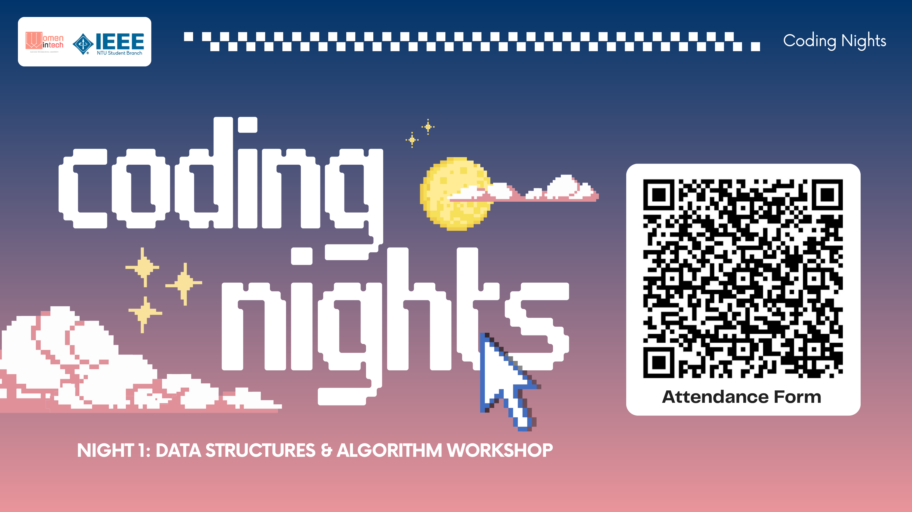</div>
---
[TIMING: 18:40 - 18:42 | 2 MINS]
[STAGE CUE: Greet the room with high energy and warmth. Look directly into the audience and camera.]

Good evening everyone, and welcome to Night 1 of Coding Nights 3.0! Please settle in, grab your seat, make sure your laptops are open, and scan the QR code right here on the screen to mark your attendance for tonight's session. 

I'm thrilled to see so many of you here in person at NTU. Tonight kicks off an intensive, student-led technical initiative brought to you by NTU Women In Tech and the IEEE NTU Student Branch. Make sure you have your attendance submitted, and let's get ready for an incredible evening of computing.

# Slide 2: Data Structures & Algorithms Workshop
<div class="pdf-slide-container">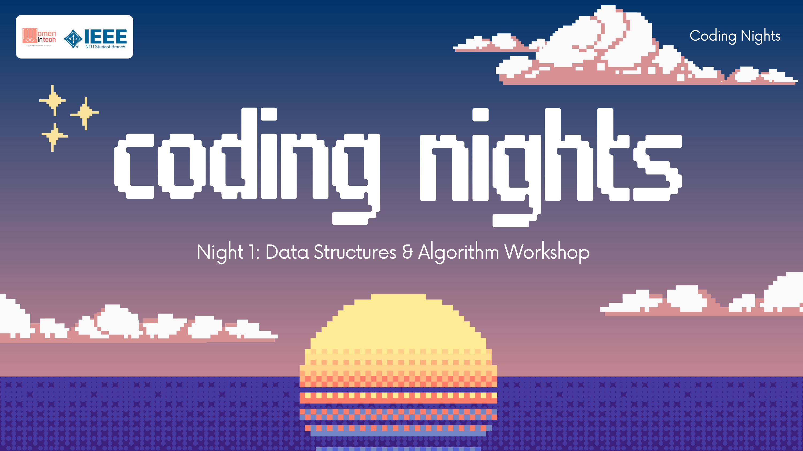</div>
---
[TIMING: 18:42 - 18:43 | 1 MIN]
[STAGE CUE: Set an empowering, reassuring tone.]

Tonight is all about Data Structures and Algorithms—not from an abstract, terrifying mathematical standpoint, but from first principles. 

We are here to strip away the interview panic that so many computer science and engineering students experience. Coding interviews are not an IQ test; they are a pattern recognition game. Over the next two hours, we will build the exact mental models that will allow you to look at an unseen problem and immediately identify its optimal solution.

# Slide 3: Attendance Checkpoint
<div class="pdf-slide-container">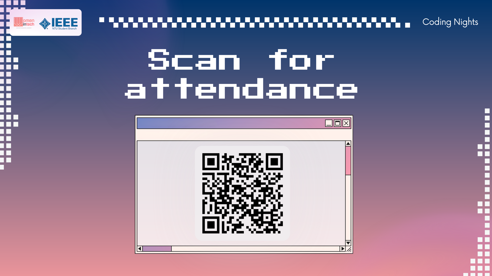</div>
---
[TIMING: 18:43 - 18:44 | 1 MIN]
[STAGE CUE: Quick pause to ensure everyone has scanned.]

Here is a full-screen view of the attendance QR code for anyone who just walked in. 

Take five seconds, scan it on your phone, and submit your matriculation details. This ensures you receive the post-session follow-up materials, the workbook links, and priority access to our technical mock interviews in Night 2.

# Slide 4: About WIT @ NTU
<div class="pdf-slide-container">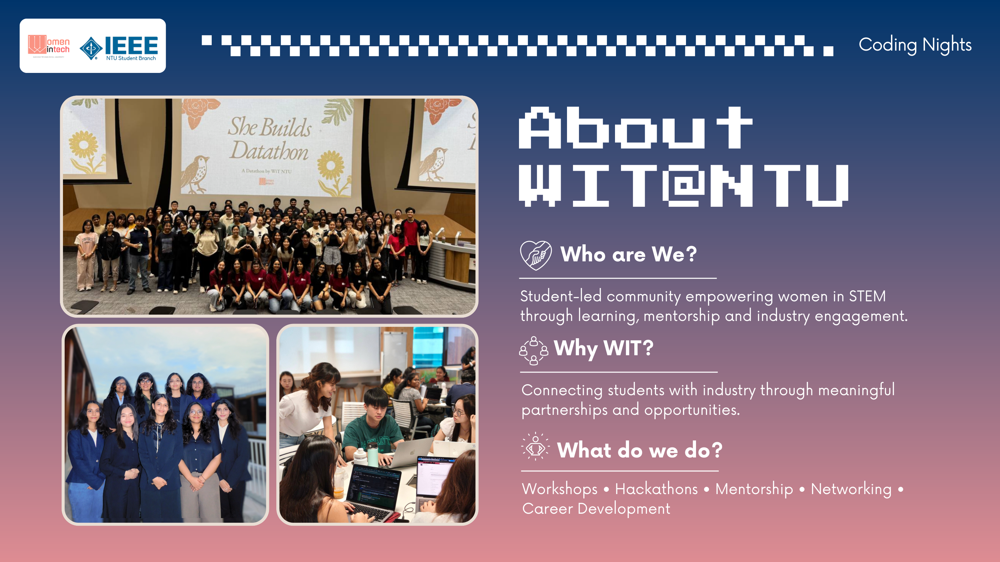</div>
---
[TIMING: 18:44 - 18:45 | 1 MIN]
[STAGE CUE: Introduce NTU Women In Tech with genuine appreciation.]

Before we dive into Big-O, I want to highlight the incredible student community that made tonight possible: NTU Women In Tech. 

WIT @ NTU is a student-led organization dedicated to empowering women and allies in STEM through hands-on learning, executive mentorship, and industry engagement. From technical hackathons and technical upskilling workshops to direct corporate networking, WIT is bridging the gap between university coursework and high-impact technology careers.

# Slide 5: WIT Flagship Initiatives
<div class="pdf-slide-container">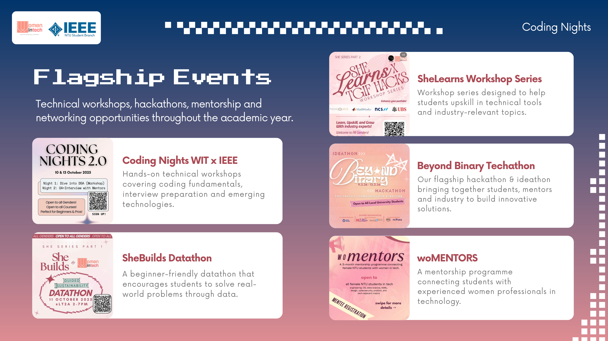</div>
---
[TIMING: 18:45 - 18:46 | 1 MIN]
[STAGE CUE: Highlight WIT flagship events on screen.]

Throughout the academic year, WIT runs several flagship initiatives that you should definitely get involved in:
- The **SheBuilds Datathon**, designed to solve real-world data science problems.
- The **SheLearns Workshop Series**, focusing on industry-standard engineering tools.
- The **Beyond Binary Techathon**, their premier hackathon uniting students and mentors.
- And **woMENTORS**, connecting students directly with senior women leaders across global tech firms.

# Slide 6: About IEEE @ NTU
<div class="pdf-slide-container">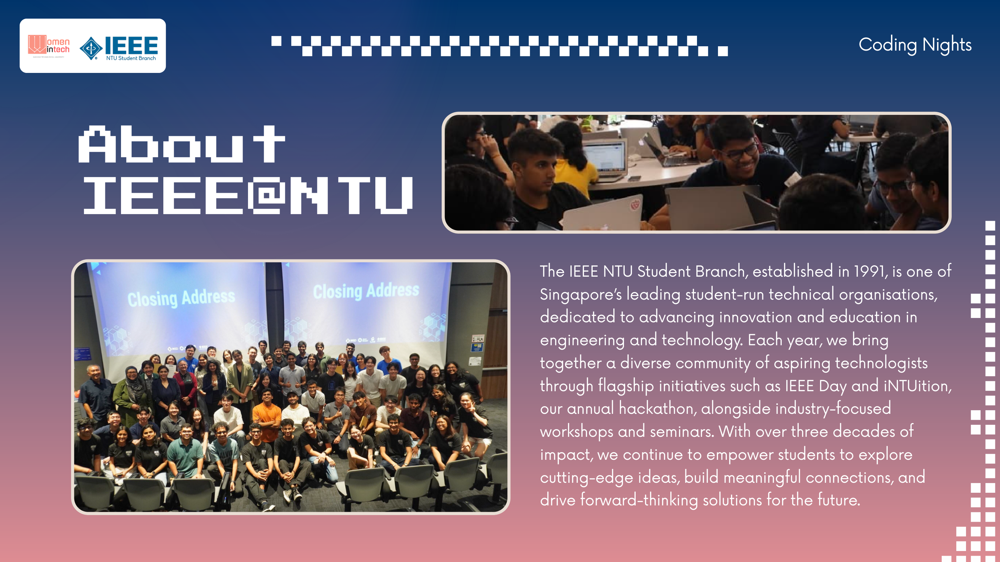</div>
---
[TIMING: 18:46 - 18:47 | 1 MIN]
[STAGE CUE: Acknowledge IEEE Student Branch.]

Co-hosting tonight is the IEEE NTU Student Branch. 

Established all the way back in 1991, IEEE NTU is one of Singapore’s leading student-run technical organizations. With over three decades of leadership, they spearhead major university initiatives like IEEE Day, technical masterclasses, and of course, iNTUition—NTU’s premier annual hackathon.

# Slide 7: IEEE Key Initiatives
<div class="pdf-slide-container">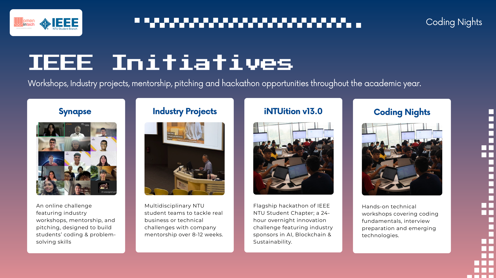</div>
---
[TIMING: 18:47 - 18:48 | 1 MIN]
[STAGE CUE: Point to Synapse and iNTUition on screen.]

Here are some of the standout programs from IEEE:
- **Synapse & Industry Projects:** Where multidisciplinary student teams spend 8 to 12 weeks building real-world software solutions with corporate engineering mentors.
- **iNTUition v13.0:** A 24-hour overnight innovation challenge featuring industry sponsors across AI, Blockchain, and Sustainability.
- And **Coding Nights:** Our dedicated technical training ground for algorithmic mastery.

# Slide 8: About Coding Nights 3.0
<div class="pdf-slide-container">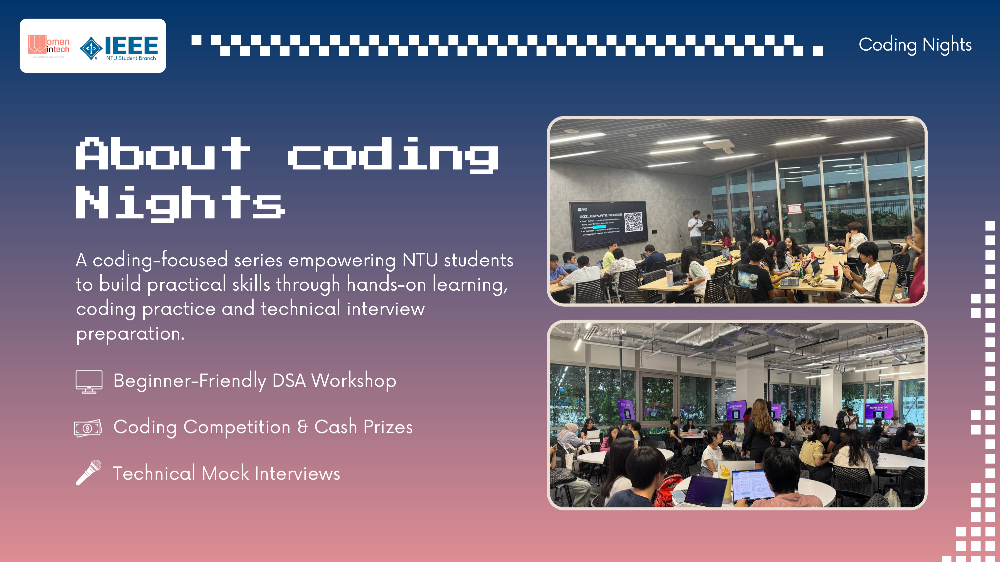</div>
---
[TIMING: 18:48 - 18:49 | 1 MIN]
[STAGE CUE: Clarify the three components of the Coding Nights series.]

What is Coding Nights? 

Coding Nights 3.0 is a multi-part series specifically designed to bridge the gap between classroom theory and real-world technical interviews. 
Tonight is **Part 1: The Beginner DSA Workshop**. 
Following this, you'll have the chance to test your skills in our coding competition with cash prizes, and culminating in Night 2 with realistic, 1-on-1 technical mock interviews conducted by industry engineers.

# Slide 9: About Your Speaker
<div class="pdf-slide-container">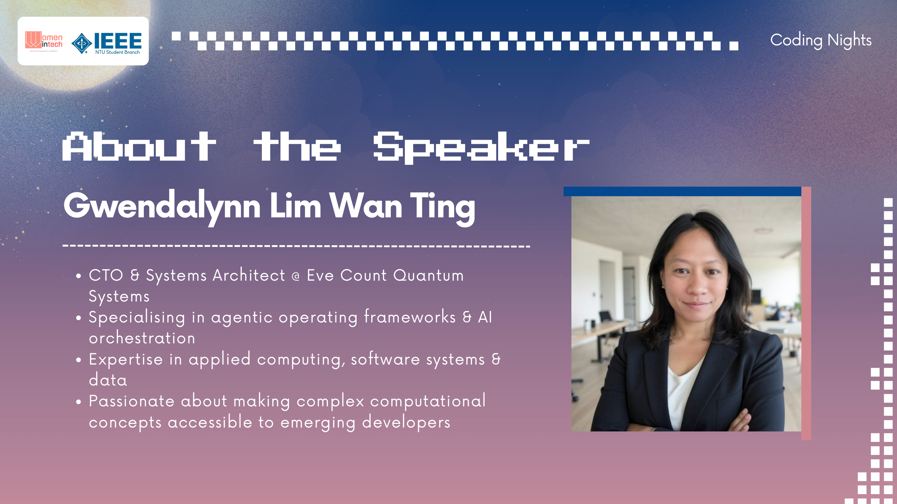</div>
---
[TIMING: 18:49 - 18:50 | 1 MIN]
[STAGE CUE: Speak naturally and warmly about your background.]

A quick word about myself: My name is Gwendalynn Lim. 

I'm the CTO and Systems Architect at Eve Count Quantum Systems. My daily work revolves around agentic operating frameworks, high-performance distributed systems, and applied computational architectures. 

When your student leads, Rishika Mehta and Saba Azad, reached out and invited me to lead this workshop, I was thrilled to accept. My personal mission tonight is to make complex computational mechanics transparent, accessible, and intuitive for every single developer in this room.

# Slide 10: Event Timeline
<div class="pdf-slide-container">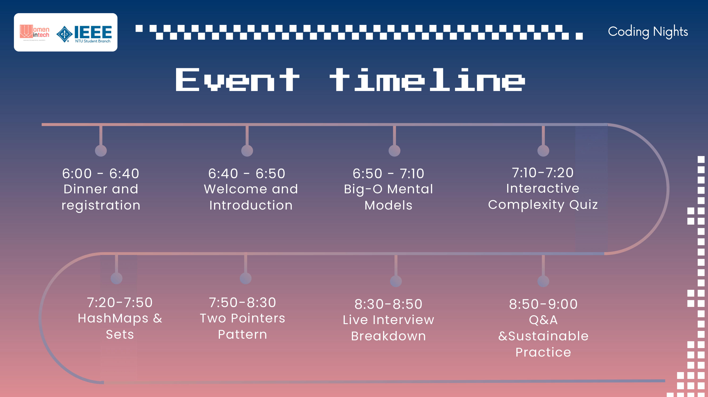</div>
---
[TIMING: 18:50 - 18:52 | 2 MINS]
[STAGE CUE: Walk through the timeline, managing room pacing.]

Here is our flight plan for the next two hours:
- **6:50 – 7:10:** Big-O Mental Models — How to analyze complexity without getting stuck in math.
- **7:10 – 7:20:** Live Interactive Quiz on Kahoot.
- **7:20 – 7:50:** Pattern 1 — HashMaps and Sets ($O(1)$ Magic).
- **7:50 – 8:30:** Pattern 2 — Two Pointers & Sliding Window techniques.
- **8:30 – 8:50:** Live Technical Interview Breakdown — Our 5-step deconstruction framework.
- **8:50 – 9:00:** Q&A, Sustainable Practice Roadmap, and wrap-up.

We have a packed agenda, so let's jump straight in.

# Slide 11: Technical Workshop Begins
<div class="pdf-slide-container">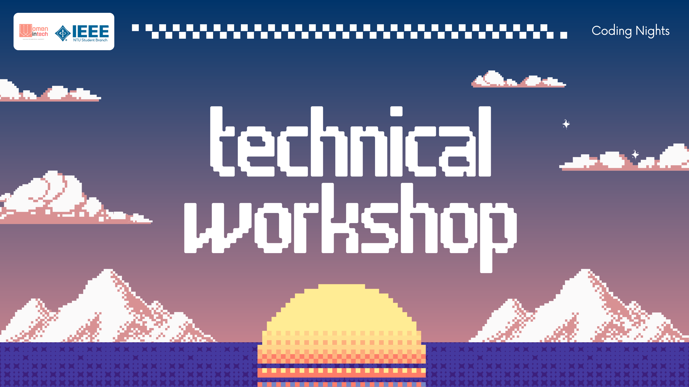</div>
---
[TIMING: 18:52 - 18:53 | 1 MIN]
[STAGE CUE: Shift into technical mode. Energy rises.]

We are now officially starting the technical workshop. 

From this moment on, think of yourself not as a student trying to pass a test, but as a software engineer designing resilient, scalable algorithms.

# Slide 12: What You Will Learn Tonight
<div class="pdf-slide-container">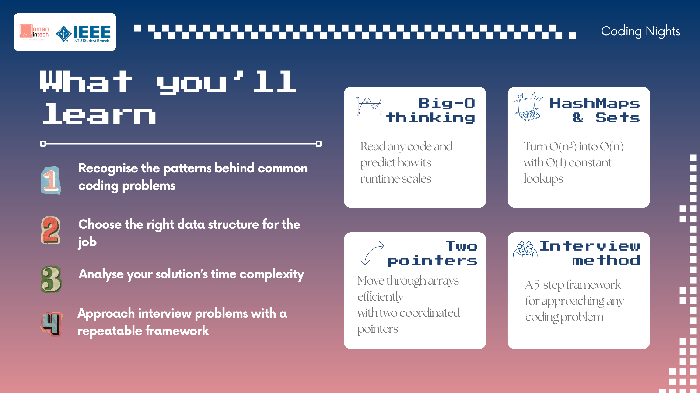</div>
---
[TIMING: 18:53 - 18:55 | 2 MINS]
[STAGE CUE: Touch on the four pillars on screen.]

Here is your tangible takeaway from tonight's session:
1. **Big-O Thinking:** You will be able to read any code block and immediately predict how its runtime scales as data explodes.
2. **HashMaps & Sets:** You will learn how to turn disastrous $O(n^2)$ nested loops into blazing-fast $O(n)$ single-pass routines using $O(1)$ direct-access lookups.
3. **Two Pointers & Sliding Windows:** You will master moving through linear structures with zero extra memory overhead.
4. **The 5-Step Interview Method:** A bulletproof, repeatable framework to dissect any unseen technical interview problem.

# Slide 13: Why Complexity Matters
<div class="pdf-slide-container">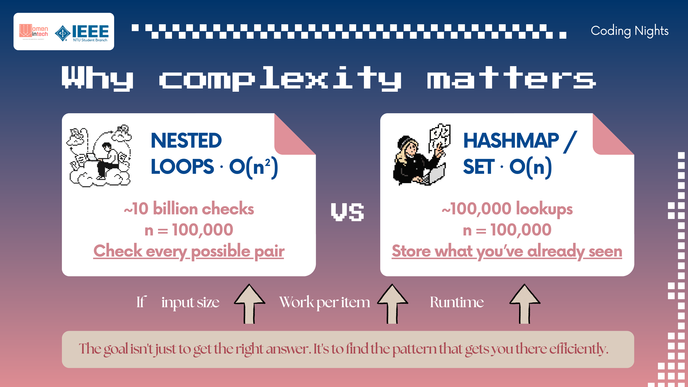</div>
---
[TIMING: 18:55 - 19:00 | 5 MINS]
[STAGE CUE: Emphasize the numerical contrast between 10 billion and 100,000.]

Look closely at the numbers on this slide. This is why Data Structures and Algorithms exist.

Imagine an input array of one hundred thousand items—$n = 100,000$. That is a modest dataset in modern software. 
If you write a brute-force nested loop that checks every possible pair, $(10^5)^2$ is **ten billion operations**. On a modern CPU core, that computation will take several minutes and trigger a Time Limit Exceeded error.

Now look at the right side: If you use a HashMap or a Set, you do one single pass. That is roughly **one hundred thousand lookups**—taking less than ten milliseconds! 
The goal of algorithmic engineering isn't just to write code that produces the right answer. Anyone can write code that works on small test cases. The true goal is finding the pattern that gets you there efficiently.

# Slide 14: Big-O: Think Growth Rate, Not Speed
<div class="pdf-slide-container">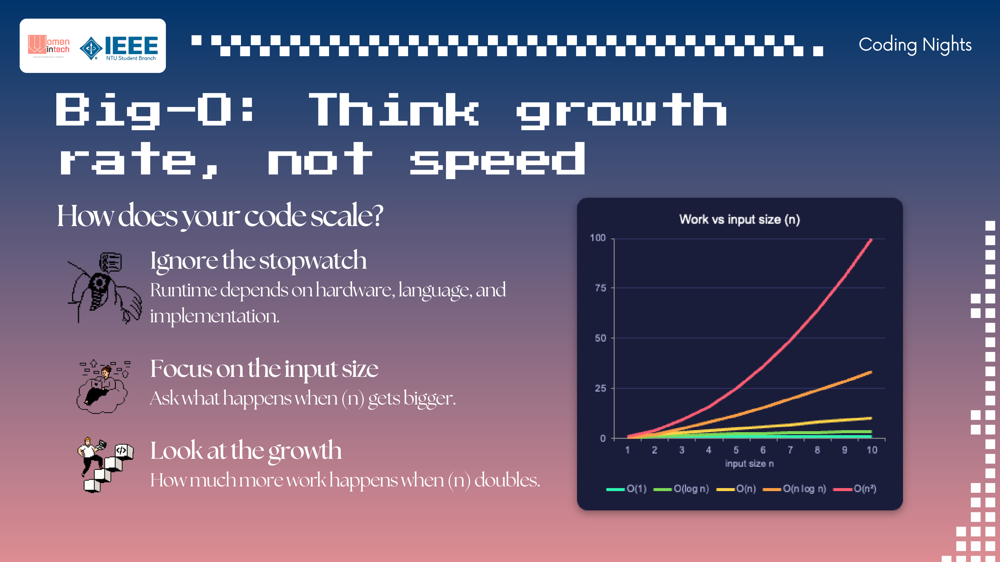</div>
---
[TIMING: 19:00 - 19:05 | 5 MINS]
[STAGE CUE: Point to 'Ignore the stopwatch'.]

Rule number one of complexity analysis: **Ignore the stopwatch.**

If you measure the speed of your Python script using `time.time()`, your measurement is meaningless. Wall-clock runtime depends on CPU clock speed, thermal throttling, background OS processes, and Python interpreter overhead. 

In computer science, we ask a fundamentally different question:
*"What happens to the work required when the input size $n$ doubles?"*
- If doubling the input doubles the work, you have linear scaling: $O(n)$.
- If doubling the input quadruples the work, you have quadratic scaling: $O(n^2)$.
- If doubling the input adds only a tiny constant step, you have logarithmic scaling: $O(\log n)$.

Big-O is the rate of growth. It is the mathematical envelope of your code.

# Slide 15: Common Complexity Classes at a Glance
<div class="pdf-slide-container">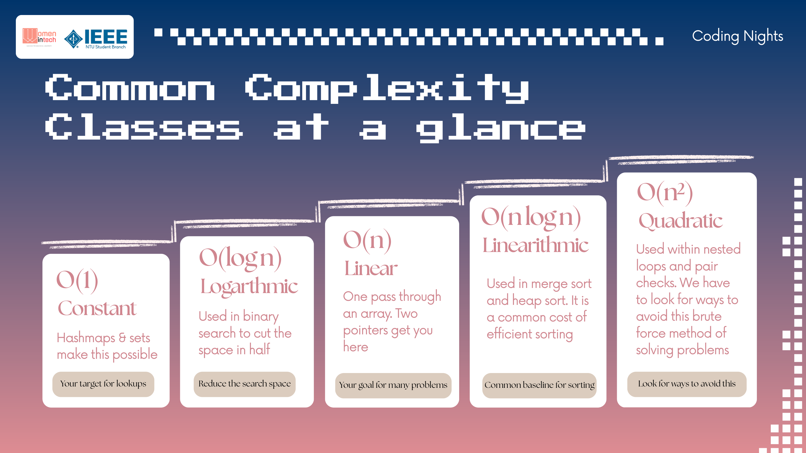</div>
---
[TIMING: 19:05 - 19:10 | 5 MINS]
[STAGE CUE: Walk left-to-right across the five columns on screen.]

Let's review the five primary complexity tiers you will encounter in technical interviews:
1. **$O(1)$ Constant Time:** Your target for lookups. HashMaps and Sets make this possible by calculating a memory address directly.
2. **$O(\log n)$ Logarithmic Time:** The gold standard for searching. Binary search cuts the problem space in half at every step.
3. **$O(n)$ Linear Time:** One single pass through the array. Two Pointers and HashMaps get you here.
4. **$O(n \log n)$ Linearithmic Time:** The mathematical baseline for comparison-based sorting, like Merge Sort or Python's Timsort.
5. **$O(n^2)$ Quadratic Time:** Nested loops comparing all pairs. In an interview, this is your baseline brute force—the code you start with, but never leave as your final answer.

# Slide 16: Time vs. Space: The Core Trade-Off
<div class="pdf-slide-container">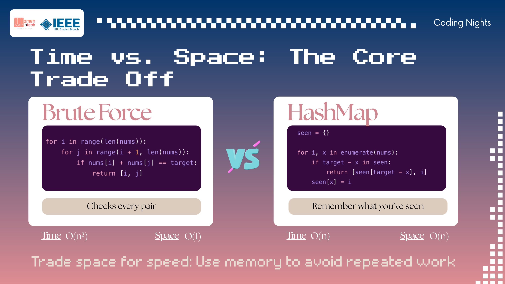</div>
---
[TIMING: 19:10 - 19:15 | 5 MINS]
[STAGE CUE: Clench one hand for RAM, the other for CPU cycles.]

Here is the central economic principle of software optimization: **The Space-Time Trade-off.**

Look at the two rows:
- **Brute Force:** Time is $O(n^2)$, but Space is $O(1)$. You save memory by refusing to remember anything, forcing your CPU to re-check every pair.
- **HashMap Approach:** Time drops to $O(n)$, but Space becomes $O(n)$. You allocate memory in RAM to remember what you have already inspected.

In modern systems, RAM is cheap, but latency and CPU cycles are bounded. Whenever your algorithm is too slow, trade memory for speed. Use memory to avoid repeated work.

# Slide 17: Interactive Kahoot Quiz
<div class="pdf-slide-container">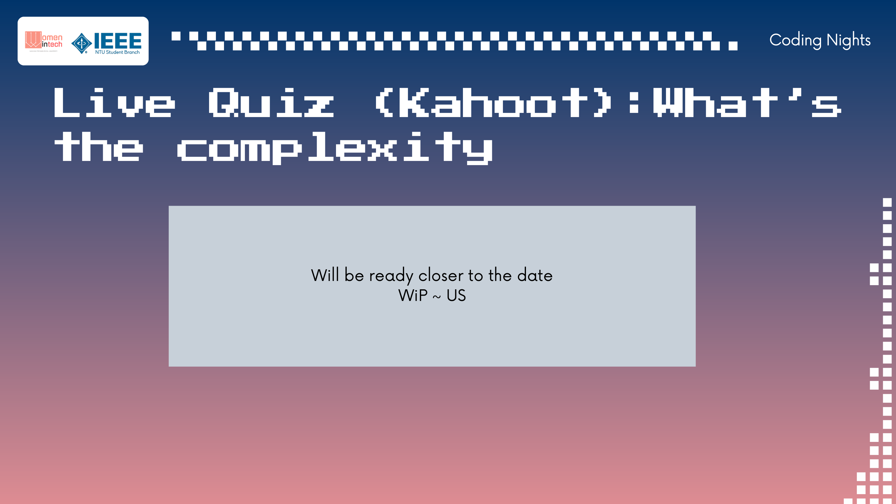</div>
---
[TIMING: 19:15 - 19:20 | 5 MINS]
[STAGE CUE: Direct students to Kahoot on screen. Encourage participation.]

Now, let's put your intuition to the test with our live Kahoot checkpoint!

Pull out your phones or open a new browser tab, enter the game PIN shown on the screen, and let's see who can analyze these algorithmic complexity snippets the fastest. We have some great spot prizes for our top scorers tonight!

[INTERACTION: Host the 5-minute Kahoot quiz, commenting on correct answers and common traps.]

# Slide 18: HashMaps & Sets: The O(1) Trick
<div class="pdf-slide-container">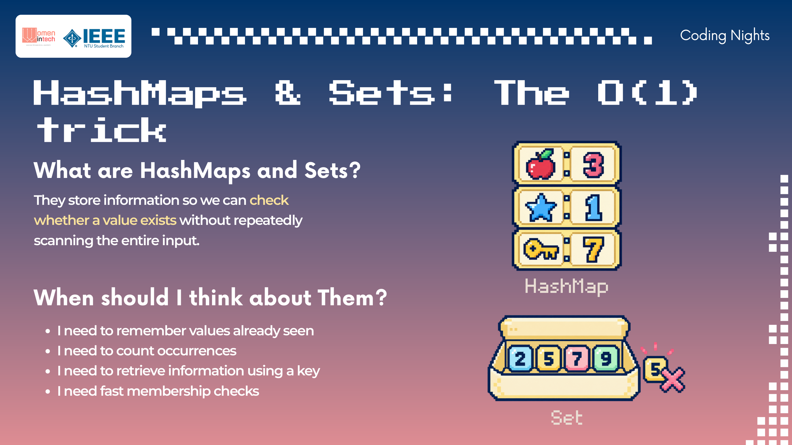</div>
---
[TIMING: 19:20 - 19:25 | 5 MINS]
[STAGE CUE: Transition into Pattern 1. Speak deliberately.]

Let's begin our first core pattern: **HashMaps and Sets.**

What is the fundamental purpose of a Hash Table? 
It stores information in contiguous memory so that we can check whether a value exists without repeatedly scanning the entire input array.

When should you immediately think of a HashMap or a Set?
1. When you need to remember values you've already seen.
2. When you need to count occurrences (frequencies).
3. When you need to retrieve associated data (like an original index) using a key.
4. When you need instant, constant-time membership checks.

# Slide 19: Pattern: Frequency Counter
<div class="pdf-slide-container">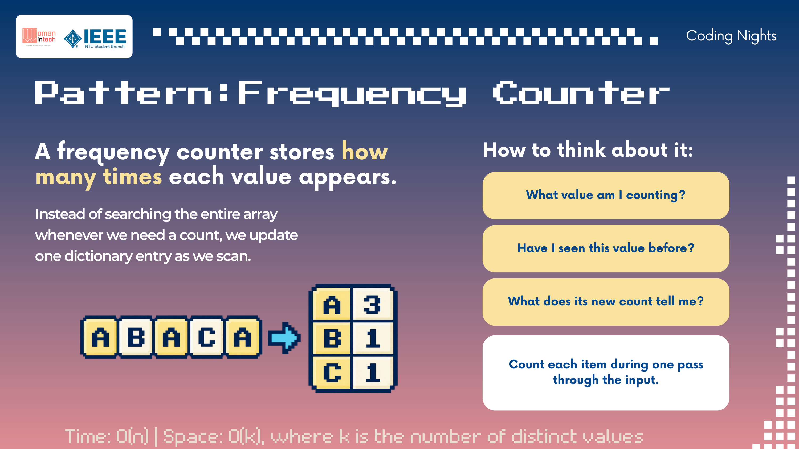</div>
---
[TIMING: 19:25 - 19:30 | 5 MINS]
[STAGE CUE: Walk through the three diagnostic questions.]

Our first sub-pattern is the **Frequency Counter**.

A frequency counter stores how many times each value appears. Instead of searching the entire array whenever we need a count, we update a single dictionary entry as we scan through the list:
```python
counts[item] = counts.get(item, 0) + 1
```

Whenever you tackle a frequency problem, ask yourself three questions:
1. *What value am I counting?*
2. *Have I seen this value before?*
3. *What does its updated count tell me about my problem's goal?*

Time complexity is $O(n)$ because we touch each item once. Space complexity is $O(k)$, where $k$ is the number of distinct values.

# Slide 20: Problem 1.1 — Contains Duplicate
<div class="pdf-slide-container">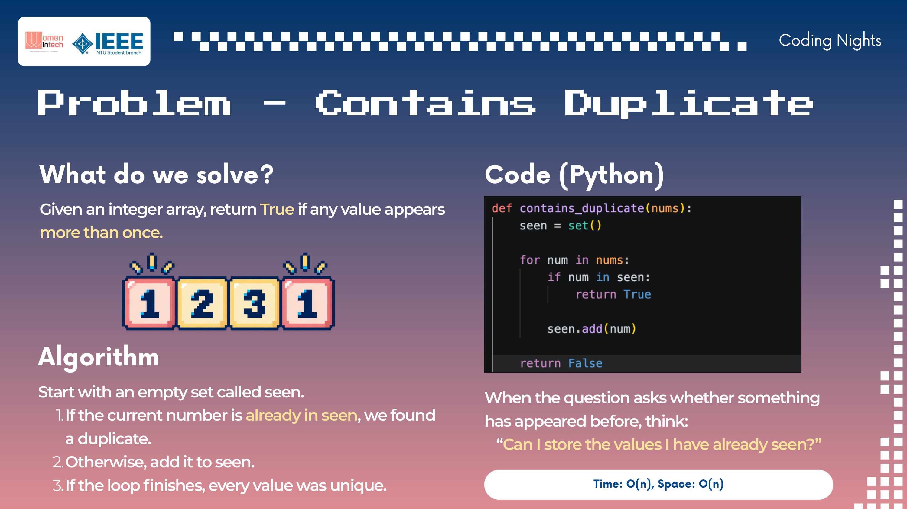</div>

```python
def contains_duplicate(nums: list[int]) -> bool:
    seen = set()
    for num in nums:
        if num in seen:
            return True  # Found duplicate in O(1)
        seen.add(num)
    return False

# Time: O(n) | Space: O(n)
```
---
[TIMING: 19:30 - 19:35 | 5 MINS]
[STAGE CUE: Trace the 3-step algorithm clearly.]

Let's look at Problem 1.1: **Contains Duplicate.**

The prompt is simple: Given an integer array, return `True` if any value appears more than once, and `False` if all elements are distinct.

Look at the algorithm:
1. Initialize an empty hash set called `seen`.
2. Iterate through each `num` in `nums`.
3. If `num` is already inside `seen`, we have found our duplicate! We exit early and return `True`.
4. Otherwise, we add `num` to `seen`.
5. If the loop completes without an early exit, every number was distinct. Return `False`.

Time complexity: $O(n)$. Space complexity: $O(n)$. Notice how allocating that `seen` set completely eliminated the need for a nested loop.

# Slide 21: Pattern: Complement Lookup
<div class="pdf-slide-container">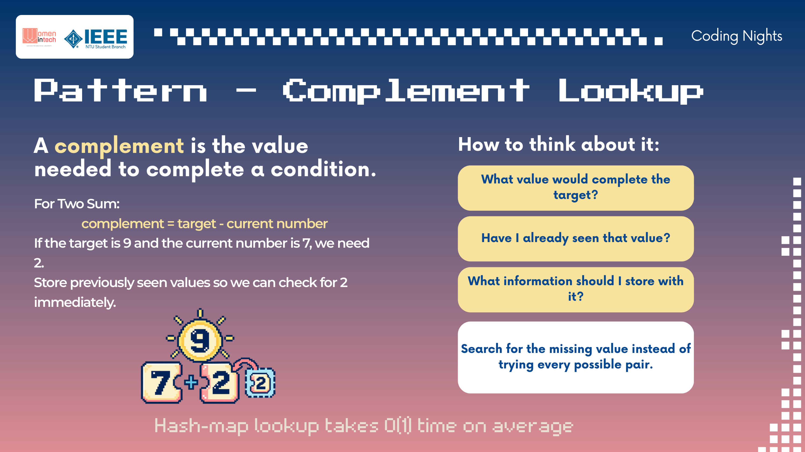</div>
---
[TIMING: 19:35 - 19:40 | 5 MINS]
[STAGE CUE: Write out the equation: target - current_num = complement.]

Now we introduce one of the most powerful mental tools in interview coding: **The Complement Lookup.**

A complement is simply the missing value required to satisfy a condition. 
For Two Sum:
$$\text{complement} = \text{target} - \text{current\_number}$$

If the target is 9, and your current number is 7, you don't need to check fifty random numbers in the array. You only need one specific number: **2**.
Instead of trying every possible pair, you search your memory for that exact missing value! Because HashMap lookups take $O(1)$ on average, you can verify if the partner exists instantaneously.

# Slide 22: Problem 1.2 — Two Sum
<div class="pdf-slide-container">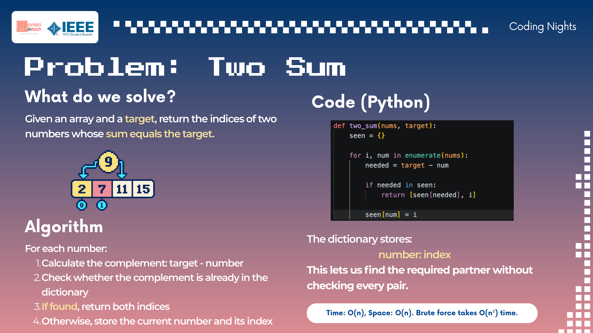</div>

```python
def two_sum(nums: list[int], target: int) -> list[int]:
    prev_map = {}  # value -> original index
    for i, num in enumerate(nums):
        complement = target - num
        if complement in prev_map:
            return [prev_map[complement], i]
        prev_map[num] = i
    return []

# Time: O(n) | Space: O(n)
```
---
[TIMING: 19:40 - 19:50 | 10 MINS]
[STAGE CUE: Highlight the prev_map[num] = i placement.]

Here is the implementation of Two Sum.

Notice how we store `number : index` in our dictionary. As we iterate with `enumerate(nums)`:
1. We calculate `complement = target - num`.
2. We check if that complement is already recorded in `prev_map`.
3. If it is, we return `[prev_map[complement], i]`.
4. If it isn't, we store our current number and its index.

Why do we check the dictionary **before** storing the current number? 
Because the problem specifies you cannot use the same element twice! If the target is 6 and the number is 3, inserting first would cause 3 to match with itself. 
Checking first guarantees that the partner was a genuinely distinct element seen in past iterations.

# Slide 23: Two Pointers: When & Why
<div class="pdf-slide-container">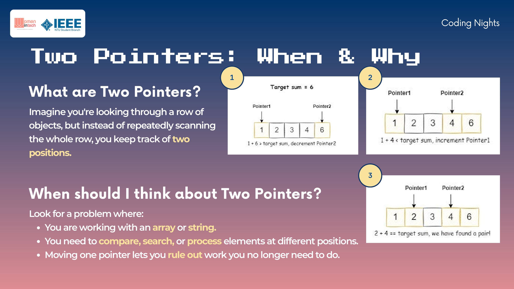</div>
---
[TIMING: 19:50 - 19:55 | 5 MINS]
[STAGE CUE: Pivot to Pattern 2. Emphasize space efficiency.]

Now let's transition to our second foundational pattern: **Two Pointers.**

HashMaps are fantastic, but they cost memory—$O(n)$ space. What if an interviewer tells you: 
*"Your solution must run in $O(1)$ extra space"*? 

That is when Two Pointers shines. Instead of rescanning the array or creating a separate hash table, we maintain two coordinated index positions across the sequence. 

When do you look for Two Pointers?
1. You are working with an array or string.
2. You need to compare, search, or process elements at different positions.
3. Crucially: Moving one pointer allows you to permanently rule out work you no longer need to consider.

# Slide 24: Pattern: Converging Pointers
<div class="pdf-slide-container">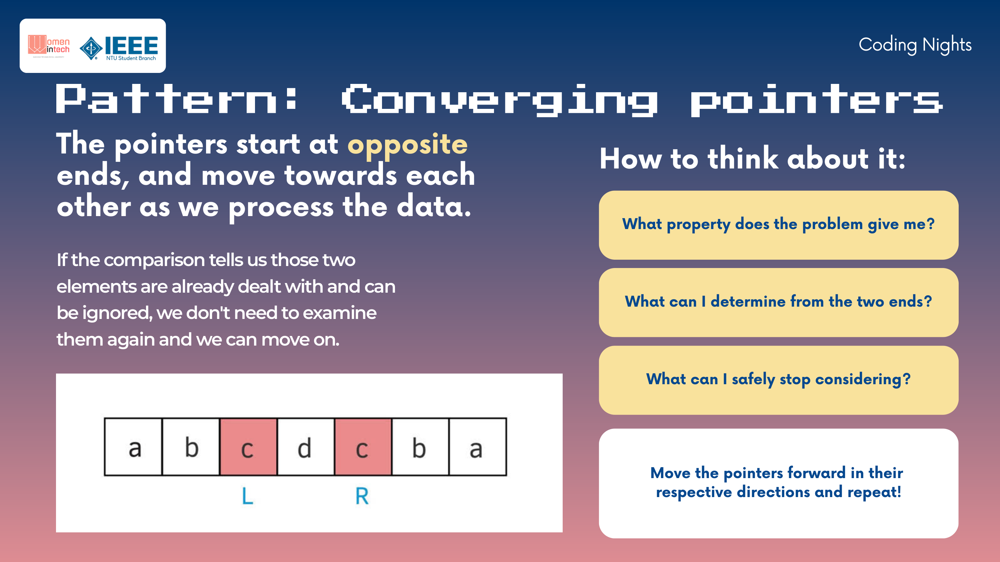</div>
---
[TIMING: 19:55 - 20:00 | 5 MINS]
[STAGE CUE: Move hands together to demonstrate the converging squeeze.]

The first topology is **Converging Pointers**.

Your pointers start at opposite ends of the structure: `left = 0` and `right = len(arr) - 1`. They move towards each other as you process the data.

Once a comparison tells you that those two boundary elements have been validated, you squeeze inward. You never need to look at them again. 

Ask yourself three questions:
1. *What property does the problem give me (e.g. symmetry or sorting)?*
2. *What can I determine from the two outer ends?*
3. *What subset of elements can I safely stop considering?*

# Slide 25: Problem 2.1 — Valid Palindrome
<div class="pdf-slide-container">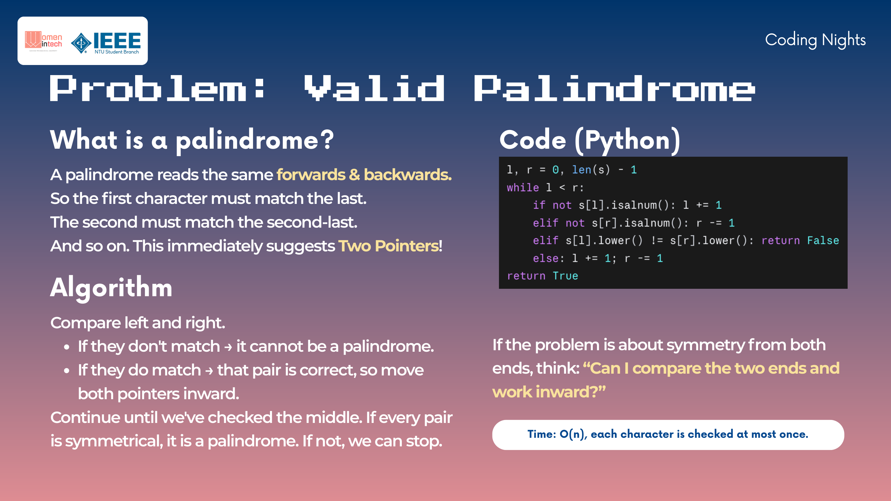</div>

```python
def is_palindrome(s: str) -> bool:
    left, right = 0, len(s) - 1
    while left < right:
        while left < right and not s[left].isalnum():
            left += 1
        while left < right and not s[right].isalnum():
            right -= 1
        if s[left].lower() != s[right].lower():
            return False
        left += 1
        right -= 1
    return True

# Time: O(n) | Space: O(1)
```
---
[TIMING: 20:00 - 20:08 | 8 MINS]
[STAGE CUE: Emphasize the inner while left < right boundary guard.]

Look at Problem 2.1: **Valid Palindrome.**

A palindrome reads identically forward and backward. That means character 0 must match character $n-1$; character 1 must match character $n-2$. 

Many candidates make the junior mistake of cleaning the string first with `"".join(...)` and checking `cleaned == cleaned[::-1]`. That allocates a brand new $O(n)$ string in memory!

With Converging Pointers, we do it in-place in $O(1)$ extra space:
- We advance `left` past any non-alphanumeric punctuation.
- We advance `right` backward past any punctuation.
- We compare the normalized lowercase characters. If they mismatch, return `False`.
- Otherwise, squeeze inward: `left += 1`, `right -= 1`.

Notice the inner while loops are protected by `left < right`. That prevents index out-of-bounds errors on strings containing only spaces or symbols.

# Slide 26: Pattern: Sliding Window
<div class="pdf-slide-container">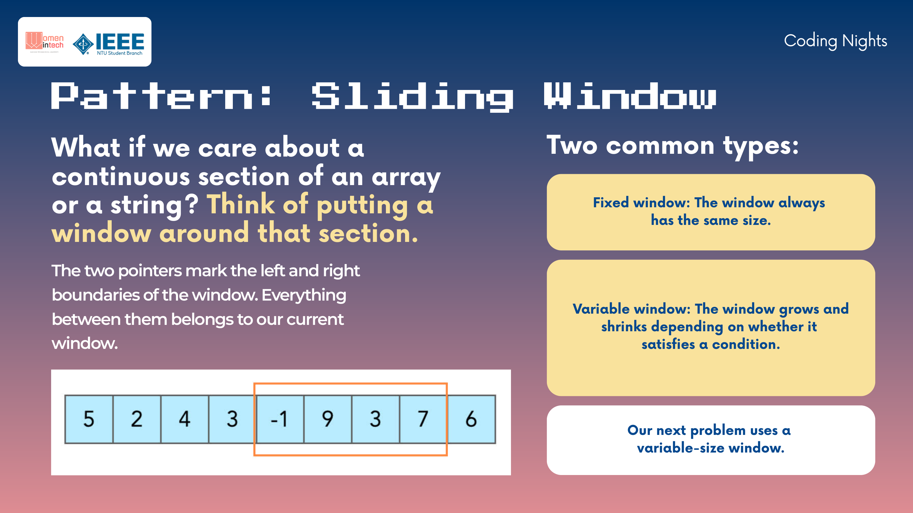</div>
---
[TIMING: 20:08 - 20:13 | 5 MINS]
[STAGE CUE: Describe the window expanding and contracting.]

Now we examine our next sub-pattern: **The Sliding Window.**

What if a problem cares about a continuous subarray or substring? Think of placing an adjustable frame or window over that section.

The two pointers define the boundaries: `left` is the start of the window, and `right` is the end. Everything between them is your active window.

There are two primary types of sliding windows:
1. **Fixed Window:** The window maintains a constant length $k$ (e.g. finding the maximum sum of any 3 consecutive numbers).
2. **Variable Window:** The window dynamically expands to ingest new elements and shrinks when a constraint is violated.

Let's see a variable window in action on one of the most famous LeetCode medium questions: Longest Substring Without Repeating Characters.

# Slide 27: Problem 2.2 — Longest Substring Without Repeats
<div class="pdf-slide-container">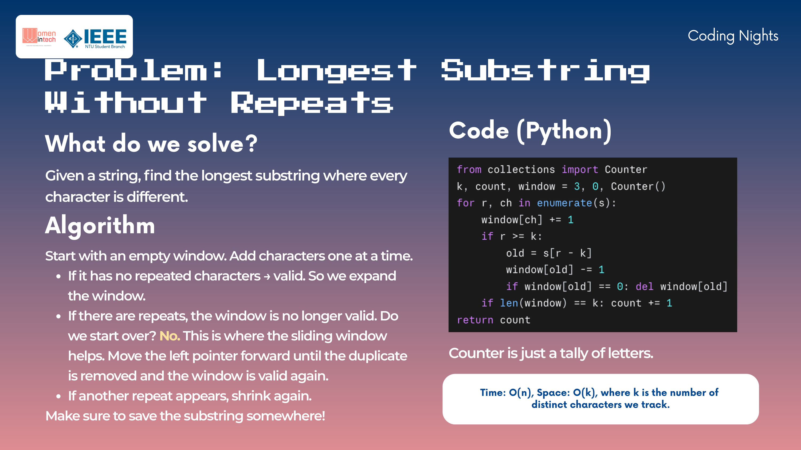</div>

```python
def length_of_longest_substring(s: str) -> int:
    char_set = set()
    left = 0
    max_len = 0
    for right in range(len(s)):
        while s[right] in char_set:
            char_set.remove(s[left])
            left += 1
        char_set.add(s[right])
        max_len = max(max_len, right - left + 1)
    return max_len

# Time: O(n) | Space: O(min(n, m))
```
---
[TIMING: 20:13 - 20:20 | 7 MINS]
[STAGE CUE: Trace the right expansion and the while s[right] in char_set shrink loop.]

Look at how elegant this Sliding Window solution is.

We maintain a set `char_set` that tracks every unique character currently inside our window.
We iterate with `right` across the string:
- If `s[right]` is already in `char_set`, our window is invalid! We have a duplicate!
- Do we throw away our progress and start from scratch? Absolutely not!
- We simply shrink the window from the left: `char_set.remove(s[left])` and `left += 1` until the duplicate is evicted!
- Once valid, we add `s[right]` to our set and update `max_len = max(max_len, right - left + 1)`.

Each character is added to the set once and removed at most once. Therefore, the time complexity is strictly $O(n)$!

# Slide 28: Pattern: In-Place Manipulation
<div class="pdf-slide-container">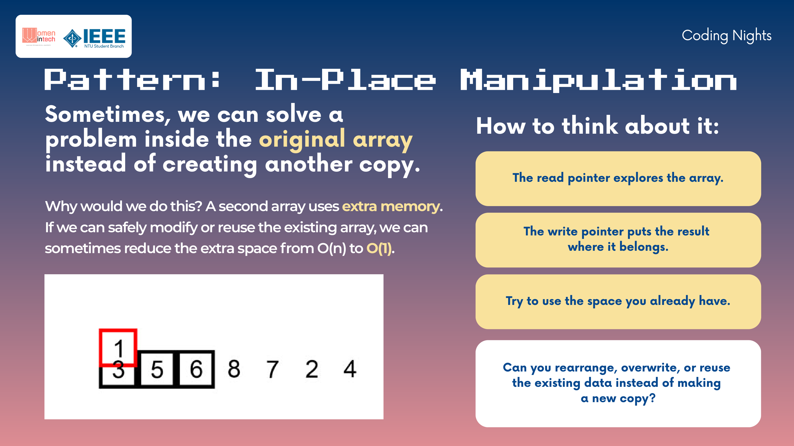</div>
---
[TIMING: 20:20 - 20:23 | 3 MINS]
[STAGE CUE: Explain the Read vs. Write pointer dynamic.]

Our final pointer technique is **In-Place Manipulation**.

Sometimes you can solve a problem directly inside the original array without creating a second copy. Why do this? Because allocating a second array burns extra memory. If you can modify or reuse the existing structure, you drop your extra space from $O(n)$ to $O(1)$.

Think of it as two roles:
- The **Read Pointer** explores the input array, inspecting incoming values.
- The **Write Pointer** places valid results in their proper destination.

Always ask: *"Can I reuse the memory I already have instead of allocating a fresh copy?"*

# Slide 29: Problem 2.3 — Two Sum II (Sorted Array)
<div class="pdf-slide-container">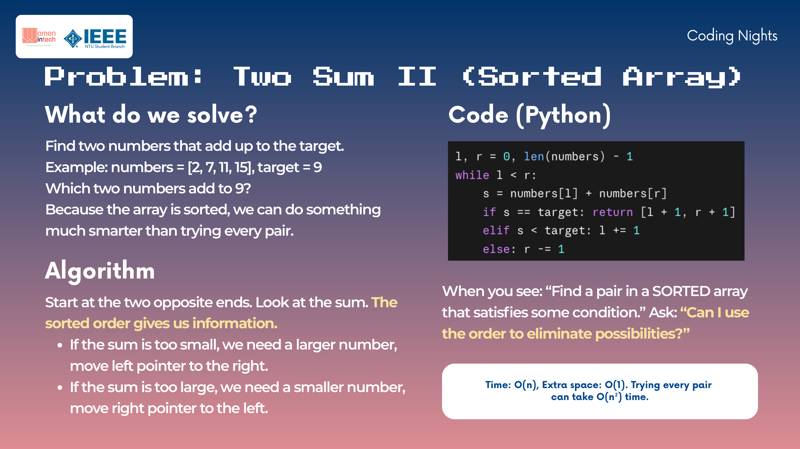</div>

```python
def two_sum_sorted(numbers: list[int], target: int) -> list[int]:
    left, right = 0, len(numbers) - 1
    while left < right:
        current_sum = numbers[left] + numbers[right]
        if current_sum == target:
            return [left + 1, right + 1]  # 1-indexed output
        elif current_sum < target:
            left += 1   # Sum too small -> increment left
        else:
            right -= 1  # Sum too large -> decrement right
    return []

# Time: O(n) | Space: O(1)
```
---
[TIMING: 20:23 - 20:30 | 7 MINS]
[STAGE CUE: Point to the Monotonicity logic: sum < target vs sum > target.]

Look at Problem 2.3: **Two Sum II (Input Array Is Sorted).**

Notice the critical clue: **The array is already sorted in non-decreasing order!**
Because it is sorted, we have a directional compass:
- `numbers[left]` is the smallest number in our search window.
- `numbers[right]` is the largest number.

Look at the logic:
- If `current_sum == target`: Match found! Return `[left + 1, right + 1]`.
- If `current_sum < target`: Our sum is too small. Since `right` is already as big as possible, the only way to get a larger sum is to move `left` forward!
- If `current_sum > target`: Our sum is too large. The only way to reduce it is to move `right` backward!

In at most $n$ steps, the pointers converge. Time: $O(n)$. Auxiliary space: $O(1)$. 
Compare this to standard Two Sum: We achieved the same linear runtime, but reduced space from $O(n)$ to $O(1)$ by exploiting sorted order!

# Slide 30: Live Technical Interview Breakdown
<div class="pdf-slide-container">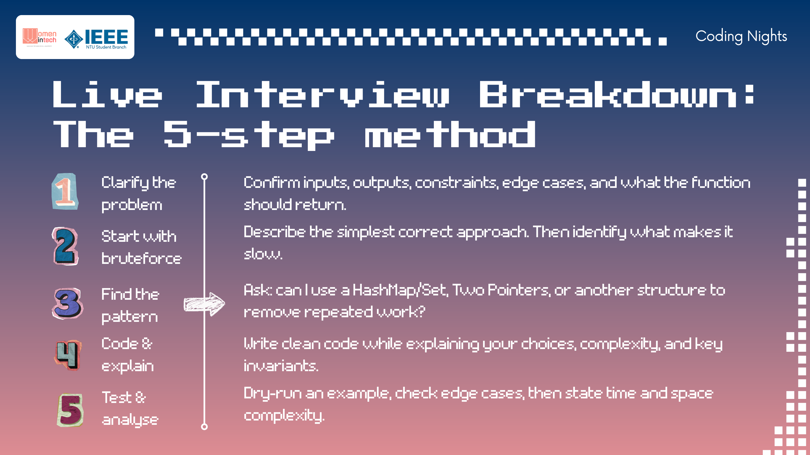</div>
---
[TIMING: 20:30 - 20:45 | 15 MINS]
[STAGE CUE: Deliver this with senior engineering authority. This is career-defining advice.]

Now, let's look at the meta-skill: **The 5-Step Technical Interview Framework.**

When an interviewer gives you a question, the worst thing you can do is immediately start typing code. Senior engineers don't write code until they understand the problem space. 

Memorize these five steps:
1. **Clarify the Problem:** Confirm the inputs, outputs, constraints, and edge cases. Ask: *"Can the input be empty? Can numbers be negative? How should I handle duplicates?"*
2. **Start with Brute Force:** Vocalize the simple, naive approach aloud. Say: *"The brute force is nested loops in $O(n^2)$ time. The bottleneck is repeatedly rescanning past elements."*
3. **Find the Pattern:** Ask yourself: *"Can I use a HashMap to eliminate repeated lookups? Or Two Pointers to leverage sorted order?"* Get alignment from the interviewer before writing code.
4. **Code & Explain:** Write clean, modular Python. Use descriptive variable names and explain your boundary checks aloud as you type.
5. **Test & Analyze (Dry-Run):** Never click 'Run Code' or say you're done. Manually trace a concrete test case on paper or in comments using a state table, and explicitly state your Big-O time and space complexity.

# Slide 31: Practice Roadmap: NeetCode 75
<div class="pdf-slide-container">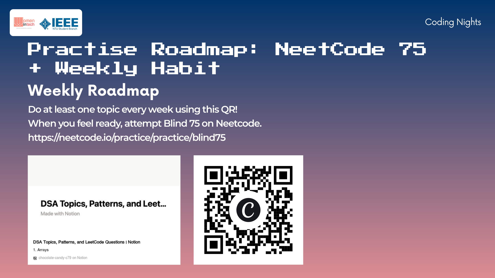</div>
---
[TIMING: 20:45 - 20:50 | 5 MINS]
[STAGE CUE: Point to the QR code on screen.]

How do you build sustainable mastery from here? 

Do not grind 500 disconnected problems. That is a recipe for burnout. Instead, follow a structured, pattern-based curriculum like **NeetCode 75** or **Blind 75**. 

Scan this QR code to access the curated roadmap:
- Dedicate **Week 1** purely to Arrays & Hashing (*Contains Duplicate*, *Two Sum*, *Group Anagrams*).
- Dedicate **Week 2** to Two Pointers (*Valid Palindrome*, *Two Sum II*, *3Sum*).
- Dedicate **Week 3** to Sliding Window (*Longest Substring*, *Minimum Window Substring*).

Master one pattern per week until you can recognize the structural cues instantly.

# Slide 32: Open Q&A Session
<div class="pdf-slide-container">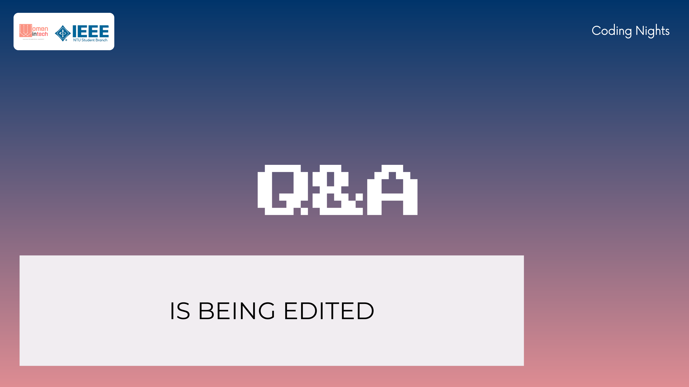</div>
---
[TIMING: 20:50 - 20:54 | 4 MINS]
[STAGE CUE: Open the floor to student questions with a warm smile.]

We have covered a tremendous amount of technical ground tonight—from asymptotic growth curves to hash collisions, converging pointers, and sliding windows.

I want to open the floor to any questions. 
Feel free to ask about any of the code examples, technical interview strategies, or how to handle nervousness during live coding sessions. What's on your mind?

[INTERACTION: Take 2-3 audience questions from the lecture hall.]

# Slide 33: End of Night 1
<div class="pdf-slide-container">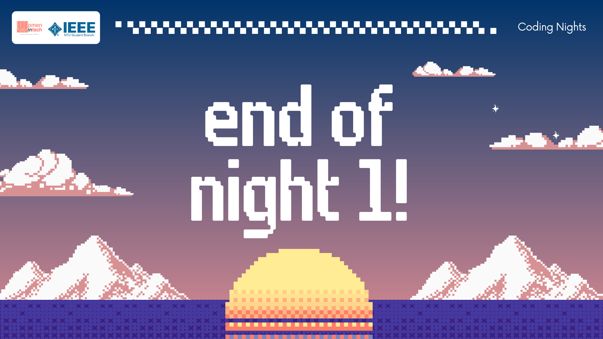</div>
---
[TIMING: 20:54 - 20:55 | 1 MIN]
[STAGE CUE: Conclude the core presentation with heartfelt applause.]

And that brings us to the conclusion of the technical workshop for Night 1! 

Give yourselves a round of applause for showing up and putting in the work. You now have the foundational mental models to deconstruct over 40% of all array and string interview problems.

# Slide 34: Token of Gratitude
<div class="pdf-slide-container">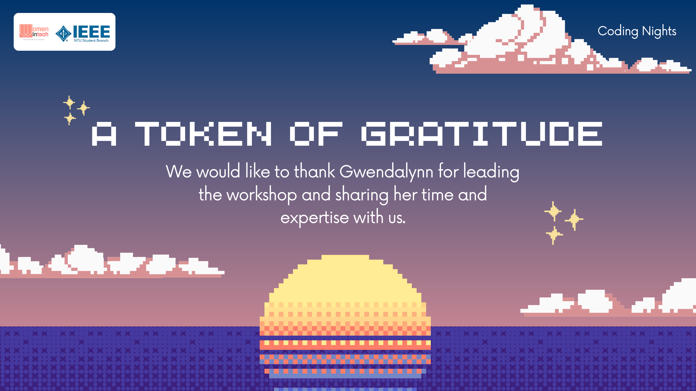</div>
---
[TIMING: 20:55 - 20:56 | 1 MIN]
[STAGE CUE: Graciously acknowledge the student committee.]

Thank you so much to the organizing committee—Rishika, Saba, and the entire team at NTU Women In Tech and IEEE NTU Student Branch. 

It has been an absolute privilege sharing tonight with all of you.

# Slide 35: Group Photo
<div class="pdf-slide-container">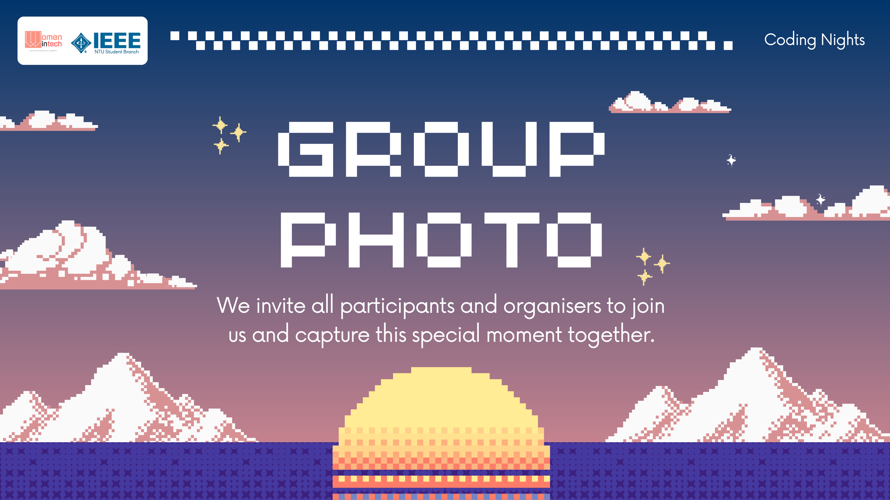</div>
---
[TIMING: 20:56 - 20:57 | 1 MIN]
[STAGE CUE: Smile and invite everyone forward for the photo.]

Before anyone leaves, we are taking a group photo to commemorate Coding Nights 3.0! 

I invite all participants and organizers to come up front so we can capture this moment together. Everyone squeeze in close!

# Slide 36: Night 2 Preview
<div class="pdf-slide-container">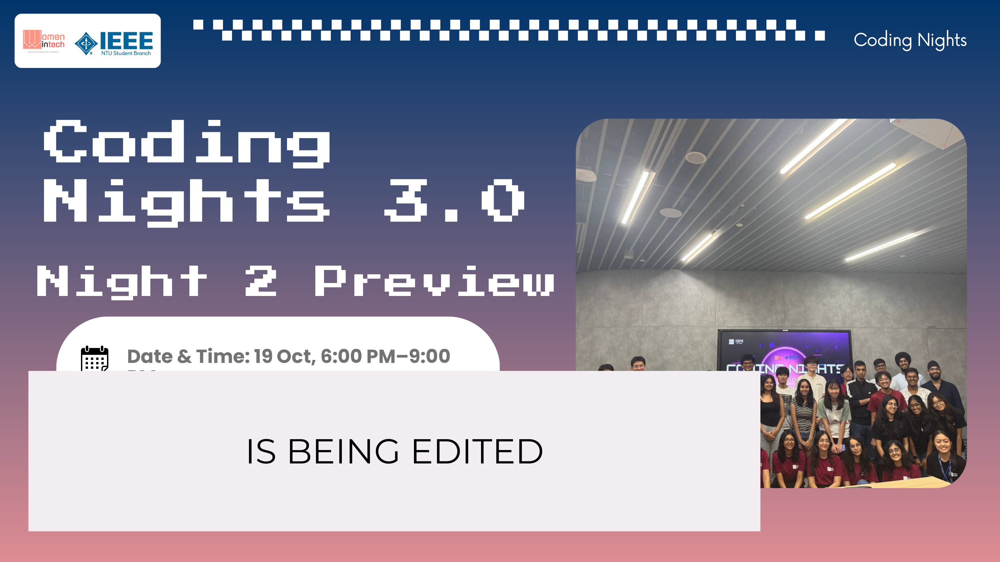</div>
---
[TIMING: 20:57 - 20:58 | 1 MIN]
[STAGE CUE: Pitch Night 2 with enthusiasm.]

Mark your calendars for **Night 2: Sunday, October 19, from 6:00 PM to 9:00 PM**!

In Night 2, we simulate the real thing:
- You will take an authentic **Online Assessment (OA)** under timed test conditions.
- Followed by **1-on-1 Technical Mock Interviews** where you will practice verbalizing your thought process to senior engineers using the 5-step framework we learned tonight.

Don't miss it!

# Slide 37: Feedback Form
<div class="pdf-slide-container">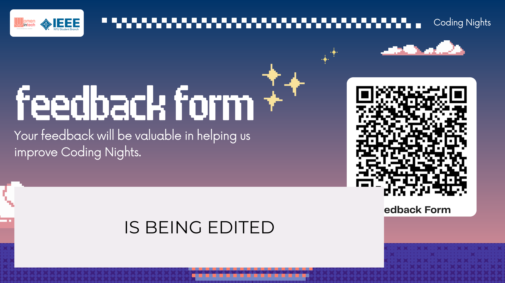</div>
---
[TIMING: 20:58 - 20:59 | 1 MIN]
[STAGE CUE: Remind students that feedback helps improve student initiatives.]

Please take thirty seconds to scan the feedback QR code on screen. 

Your feedback directly shapes future Coding Nights workshops and helps our student chapters deliver high-quality, free technical education to the NTU community.

# Slide 38: Attendance & Social Links
<div class="pdf-slide-container">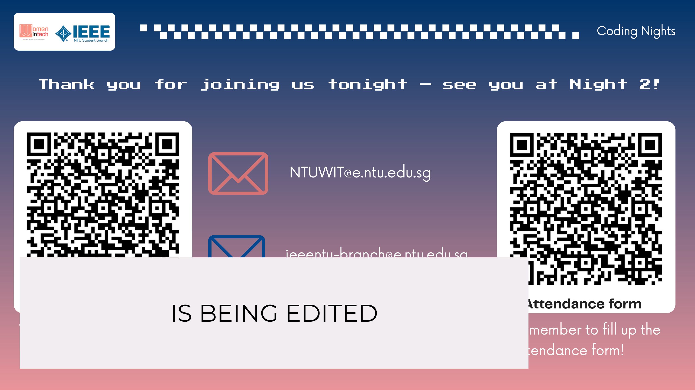</div>
---
[TIMING: 20:59 - 21:00 | 1 MIN]
[STAGE CUE: Final administrative reminder.]

If you missed the initial attendance form at the start of the night, please scan this QR code now to ensure your attendance is logged. 

You can also reach out to the organizing teams at `NTUWIT@e.ntu.edu.sg` and `ieeentu-branch@e.ntu.edu.sg`.

# Slide 39: Thank You!
<div class="pdf-slide-container">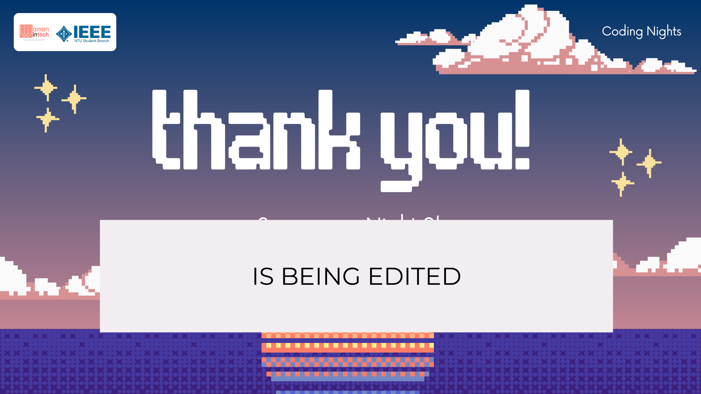</div>
---
[TIMING: 21:00 | FINAL SIGN-OFF]
[STAGE CUE: Wave to camera and audience, closing the recording session.]

Thank you all so much for coming to Coding Nights 3.0: Night 1! 

Remember: Algorithms are not magic. They are simply structured patterns waiting to be decoded. 

Keep practicing, keep analyzing your complexity, check out the companion GitHub repository at `github.com/evecount/algorithmic-thinking-starter`, and I will see you all for Night 2 on October 19th! Goodnight!
